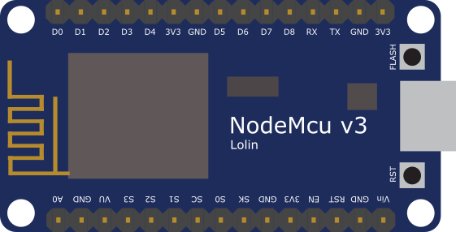

# nodemcu-v3-fritzing
NodeMCU v3 Fritzing model

## Merged to https://github.com/roman-minyaylov/fritzing-parts

(based on https://github.com/squix78/esp8266-fritzing-parts/tree/master/nodemcu-v1.0)
